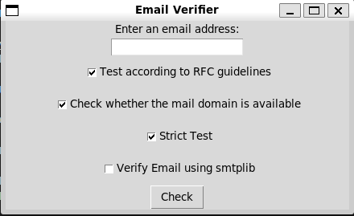
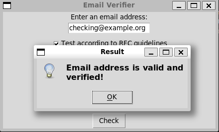

# Email Verifier

Email Verifier is a simple Python application built with Tkinter that allows you to check the validity and verify email addresses. It provides options to perform strict regex tests, test according to RFC guidelines, check the availability of the mail domain, and verify the email using smtplib.




## Requirements

- Python 3.x
- Tkinter (included with Python standard library)

## Usage

1. Clone the repository or download the source code files.

2. Run the application by executing the `application.py` file:

```bash
python application.py
```

3. The Email Verifier GUI will open with a terminal-like appearance.

4. Enter the email address you want to verify in the "Enter an email address" field.

5. Choose the tests you want to perform by selecting the checkboxes:

   - **Strict Test**: Checks the email address using a simple regex pattern.
   - **Test according to RFC guidelines**: Checks the email address using a regex pattern based on RFC standards.
   - **Check whether the mail domain is available**: Verifies if the domain in the email address is available.
   - **Verify Email using smtplib**: Attempts to verify the email address using the `smtplib` library.

6. Click the "Check" button to perform the selected tests.

7. A pop-up message will indicate whether the email address is valid and, if selected, whether it is verified using `smtplib`.

## Notes

- The email address verification is based on regex patterns and domain availability checks. While it ensures basic compliance with RFC guidelines, it may not cover all possible valid or invalid email address variations.

- The "Verify Email using smtplib" option relies on an active internet connection and may not work for certain email addresses or in some network environments.

## Contributing

Contributions to this project are welcome! If you find any issues or have suggestions for improvements, please feel free to open an issue or create a pull request.

## License

This project is licensed under the Apache License. See the [LICENSE](LICENSE) file for details.

## Credits

- [OpenAI's GPT-3.5](https://openai.com/) for providing the AI assistant that helped in creating this README.
- [RFC Email](https://haacked.com/archive/2007/08/21/i-knew-how-to-validate-an-email-address-until-i.aspx/)
- [Email Verifier](https://www.scottbrady91.com/email-verification/python-email-verification-script)
- Tkinter-based GUI interface for the application.
